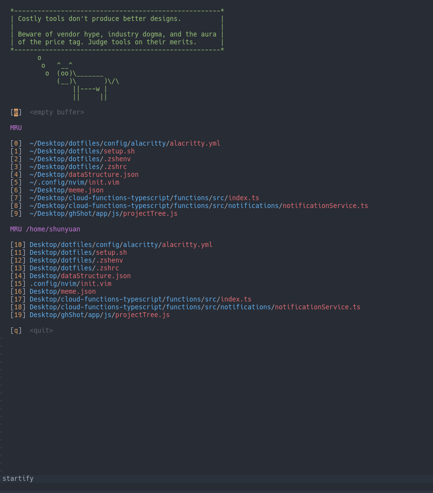

# Terminal
I am currently using alacritty as my temrinal emulator because it supports true color. This allows me to add a seperate colorscheme to my neovim without following the colors of my terminal
Love me some sheep

# SpaceVim
I don't use this crap anymore cause I have no idea how to configure it and the documentation is meh

# Install.sh
Cause I am a lazy man

# Why am I writing this?
I have no idea :O
